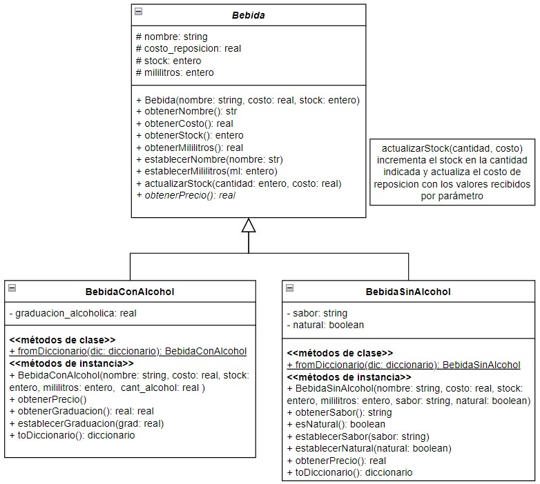

# Segundo parcial - Tema 1

## API de bebidas para la Taberna de Moe

Moe implemento con un programador experimentado en su taberna una API que le permita gestionar las bebidas. 

Moe quieso establecer los precios de las bebidas de forma distinta:
- El precio de venta de las bebidas sin alcohol surge de incrementar un 50% el costo de reposición.
- El precio de venta de las bebidas alcohólicas se calcula como el costo de reposición más un 60%.

### Modelo de Datos

Las bebidas están modeladas de la siguiente manera:

### Tarea

El programador de Moe se fue a trabajar al extranjero y cuando Moe quiso expandir su api te busco como reemplazo. Tu tarea es expandir la api para que mantenga un listado de clientes y guarde la bebida preferida por cliente.

1. Completá el código que falta para que la API funcione. 

### Descripción de la API

La API de bebidas ya permite realizar las siguientes operaciones:

1. *Crear una bebida*: Crear una nueva bebida con o sin alcohol proporcionando los atributos necesarios como nombre, costo, stock, mililitros, y otros específicos de cada tipo de bebida.
2. *Obtener todas las bebida*s: Recuperar una lista de todas las bebidas almacenadas en el sistema.
3. *Obtener una bebida por nombre*: Recuperar los detalles de una bebida específica utilizando su nombre.
4. *Actualizar una bebida*: Modificar los atributos de una bebida existente.
5. *Eliminar una bebida*: Eliminar una bebida del sistema utilizando su nombre.

**La expansión implica que tenga las siguientes operaciones:**

1. **Crear un cliente**: Crear un nuevo cliente proporcionando los atributos necesarios como DNI, nombre, apellido y bebida preferida.
2. **Obtener todos los clientes**: Recuperar una lista de todos los clientes almacenados en el sistema.
3. **Obtener un cliente por DNI**: Recuperar los detalles de un cliente específico utilizando su DNI.
4. **Actualizar un cliente**: Modificar los atributos de un cliente existente. No se puede modificar el DNI.
5. **Eliminar un cliente**: Eliminar un cliente del sistema utilizando su DNI.

### Requisitos

- Asegurate de que todas las operaciones CRUD funcionen correctamente. Para ello deberás crear el entorno virtual, activarlo e instalarle Flask.
- Implementa todas las operaciones CRUD para el cliente.

¡Buena suerte y manos a la obra!